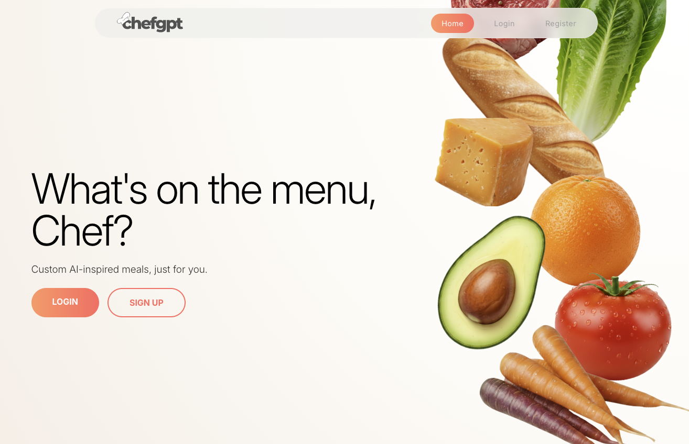
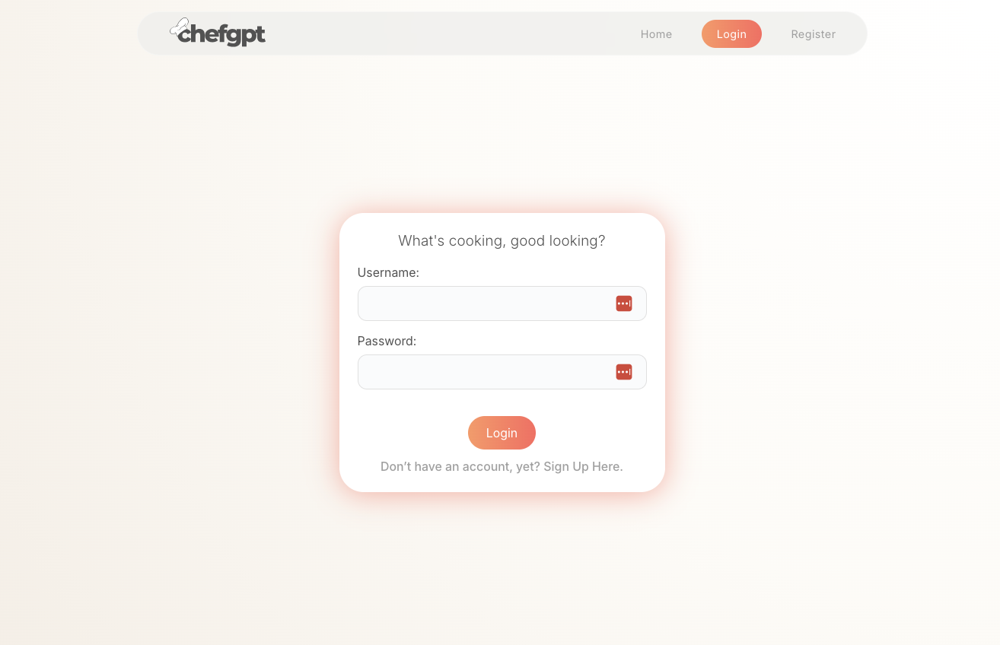
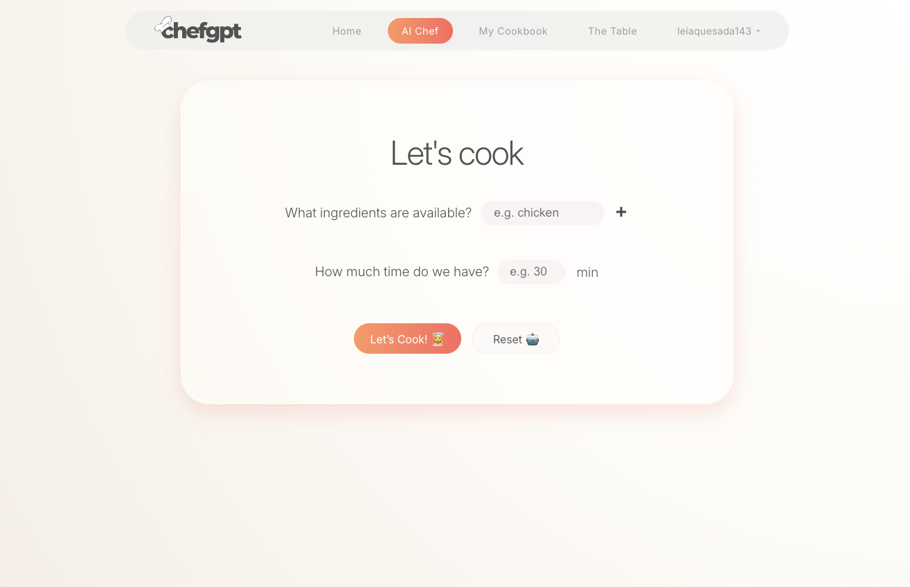
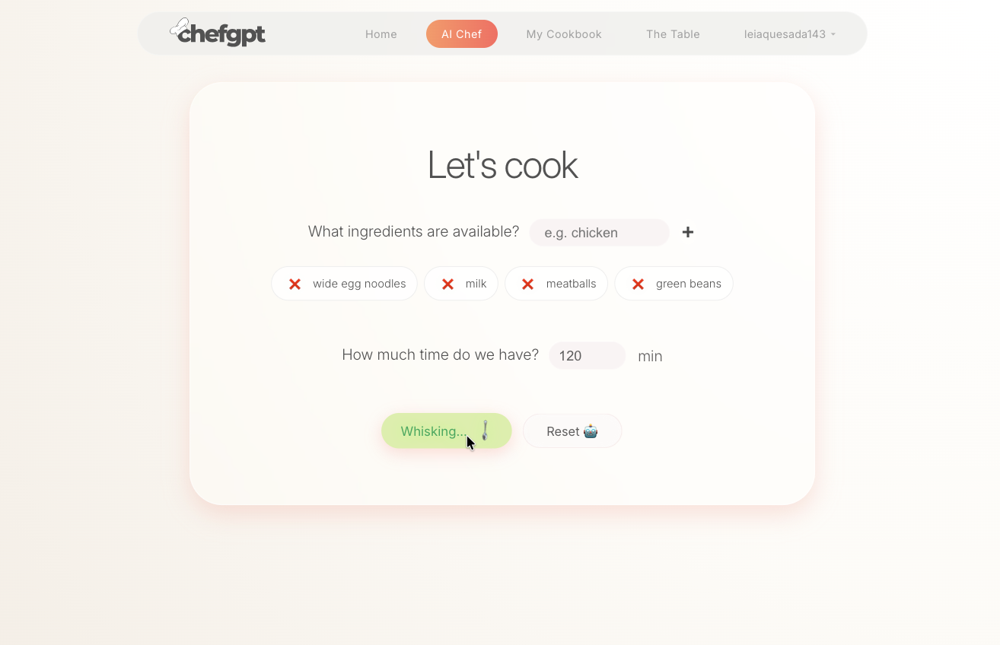
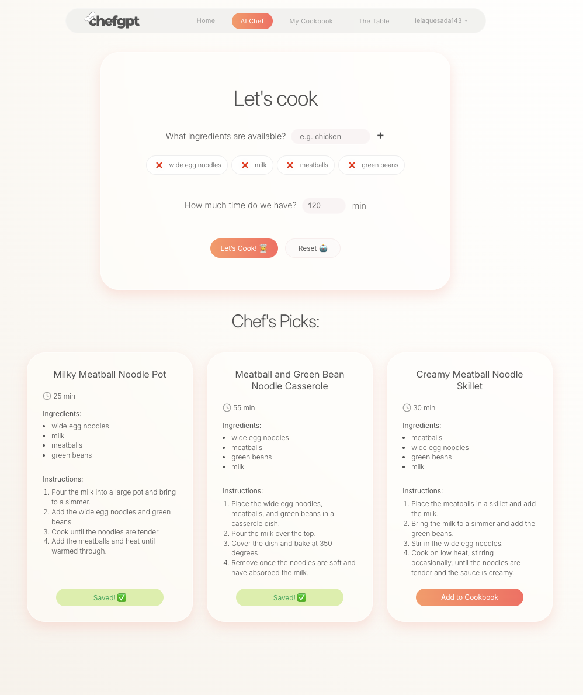
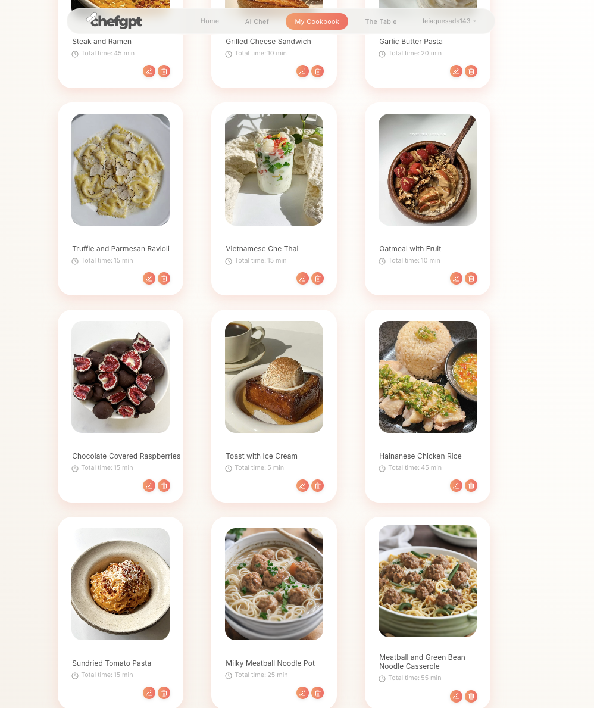
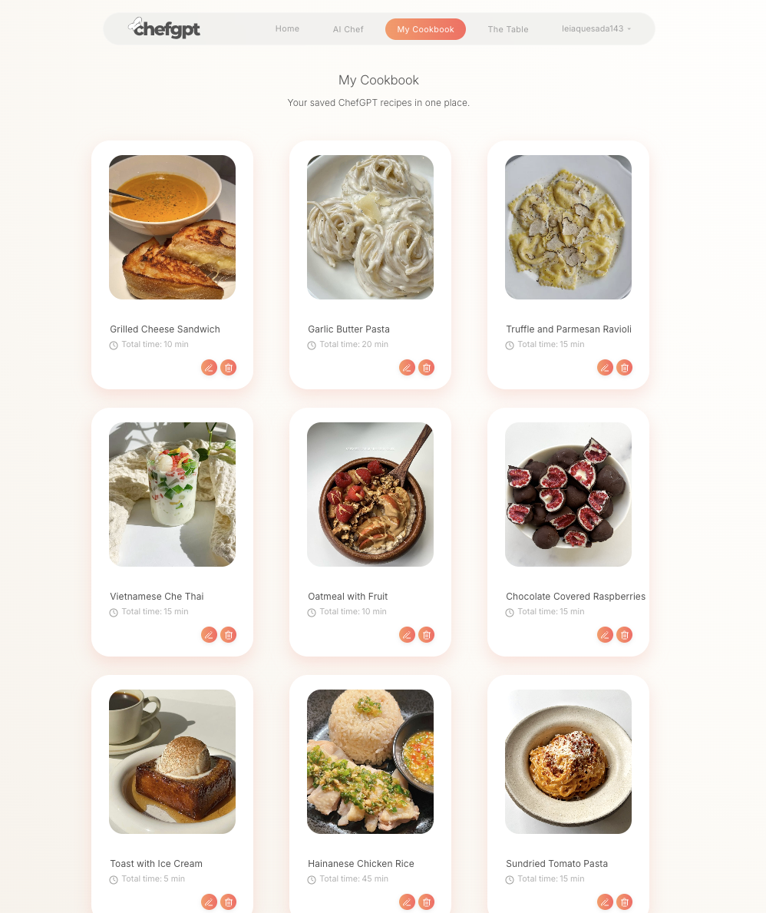
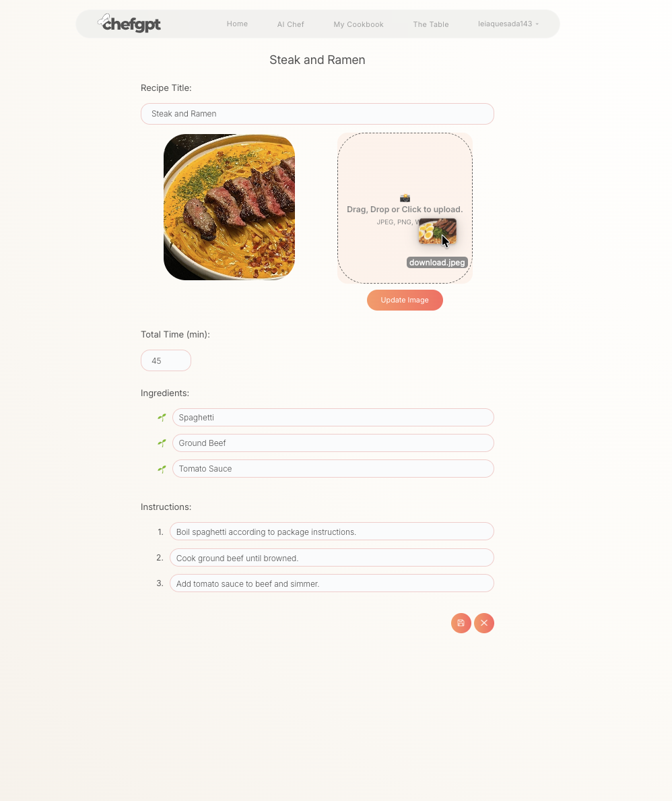

# ChefGPT

ChefGPT is a full-stack AI-powered web application that transforms user-provided ingredients into personalized, natural-language recipes using the Gemini API. Designed to simulate a personal chef experience, the app combiines scalable backend services, structured database design, and a responsive React frontend to deliver tailored culinary inspiration.



## Features:

- AI - generated recipes powered by Gemini
- User authentication (Login/Signup)
- Personal recipe storage in My Cookbook
- Community recipe sharing via The Table
- Drag-and-Drop image uploads (MinIO S3 storage)
- PostgreSQL database with seeded schema
- FastAPI backend
- React (Vite) frontend

## Tech Stack

### Frontend

- React (Vite)
- JavaScript / CSS

### Backend

- FastAPI
- Python
- PostgreSQL
- Docker
- MinIO (S3 compatible storage)

### AI Integration

- Gemini API

## Local Setup

### Prerequisites:

- Docker
- Node.js
- Python 3.10+
- Gemini API key.

### Frontend Setup

```
cd client
npm install
npm run dev
```

Visit:
http://localhost:5173/

Optional AI image placeholders: \
https://placeholders.io/ \
(Allow insecure connection if prompted)

### Backend Setup

```
cd server
python -m venv .venv
source .venv/bin/activate
pip install -r requirements.txt
```

#### Start PostgreSQL (Docker)

```
docker compose up -d
```

#### Enter database:

```
docker compose exec postgres psql -U postgres chefgpt
```

#### Inside psql:

```
\i data/chefgpt.sql;    -- seed database
\dt                     -- list all tables
exit
```

#### Start FastAPI Server:

```
fastapi dev
```

#### Swagger Docs:

http://localhost:8000/docs

## MinIO Image Storage

Access MinIO console:

http://localhost:9001 \
username: minioadmin \
password: minioadmin

## Developer Tips

- Test endpoints via Swagger UI
- Monitor FastAPI logs in backend terminal
- Watch Vite console for frontend logs
- Run SQL queries directly in psql to inspect data

## Architecture Hightlights

- RESTful API design with FastAPI
- Structured Postgres schema with seed data
- Containerized database using Docker
- Modular frontend component structure
- Clean separation of concerns

## Screenshots:








### drag and drop feature: \


