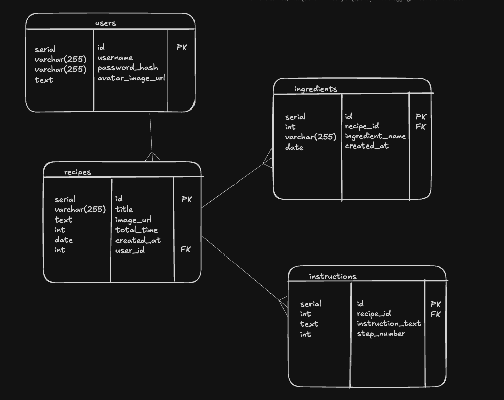

# ChefGPT

## Entity Relationship Diagram

## Set up instructions

### To run the frontend

In a terminal or command prompt, ensure you are in the root of the client directory,
Then run the following commands in the terminal:

#### Run the web server:

`npm install` \
`npm run dev`

#### In your browser, navigate to:

http://localhost:5173/

### To run the backend

Ensure you are in the root of the server directory,
Then run the following commands in the terminal:

#### Start the python virtual environment:

`python -m venv .venv` \
`source .venv/bin/activate` \
`pip install -r requirements.txt`

#### To run postgres inside a Docker container/start the database server:

`docker compose up -d`

#### connect and enter into the database server:

`docker compose exec postgres psql -U postgres chefgpt`

Once you are logged into psql. Use the following commands to create a database for this project, make it your current database, and then load in our table and sample data:

#### List all databases

postgres=# `\l`

#### Load the database schema and any sql commands in the file data injection aka seed the database

<database name>=# `\i data/chefgpt.sql;`

#### list all tables

`\dt`

#### You can log out of your database with

`exit`

# Run the web server:

`fastapi dev`

## In your browser, go to

http://localhost:8000/docs

## For access to the minio s3 photo store, navigate to 

http://localhost:9001

username: minioadmin
password: minioadmin

**Tips**: 
- Run sql queries to check the data in the database, 
- Test requests in the fastapi docs, Swagger UI 
- Watch the FastAPI server in the terminal for error logs.
- Watch the vite React server for any logs

